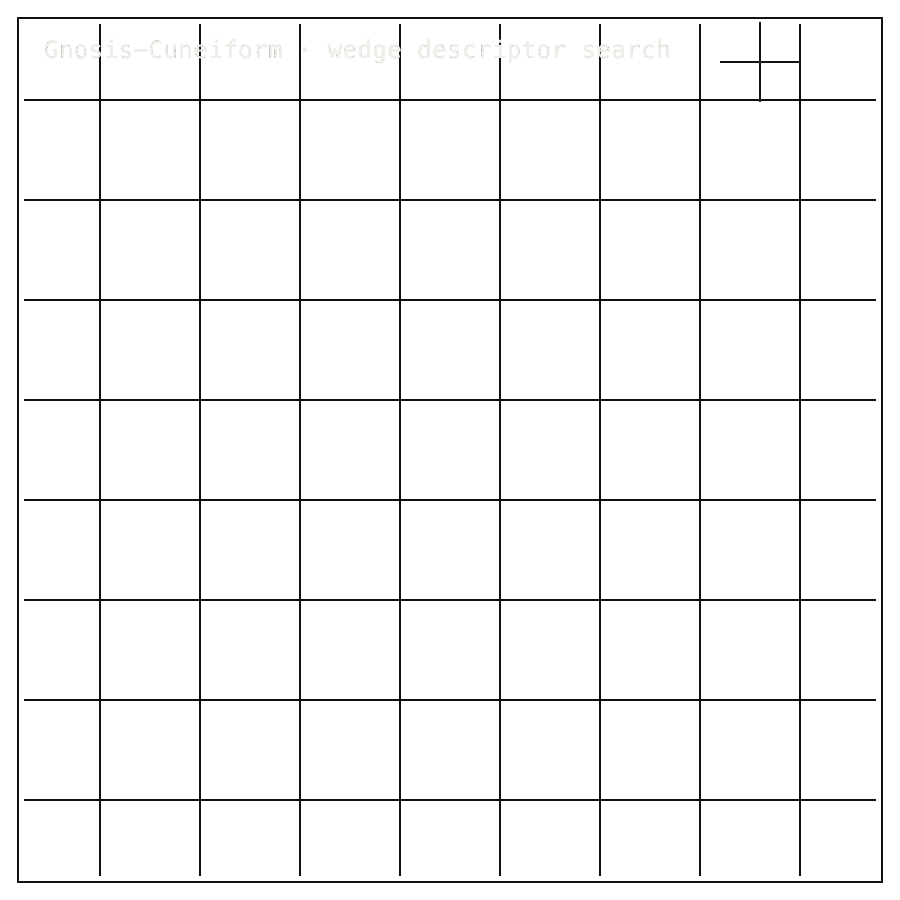

# Cuneiform

## 0. Install / Developer Commands

#### Quick Start

Verified end-to-end on 2026-04-25. Commands run from a fresh clone.

```bash

### 1. Install the smoke surface (zero third-party runtime deps; pytest pulled in for tests)
python3 -m venv /tmp/cuneiform-control
source /tmp/cuneiform-control/bin/activate
python -m pip install --upgrade pip
python -m pip install -e . pytest

### 2. Hermetic self-test against bundled fixtures (3 cases, < 1 second)
pytest -q

<table>
<tr>
<td colspan="7" valign="top">
<sub>01 · Bento cell · b-cell b-hero cell-7 row-2</sub>
<div><span><b>00 · GNOSIS-CUNEIFORM</b> · COMPUTATIONAL MORPHOLOGY</span><span>RESEARCH-READY · P5 NO-GO</span></div>
      <h1>Five thousand years of writing, searchable by <span>its shape.</span></h1>
      <p>Cuneiform morphology, kept honest &middot; Gnosis-Cuneiform &middot; PyPI <em>cuneiform-control</em> v0.1.0 &middot; github.com/Zer0pa/Cuneiform</p>
      <p>Cuneiform is one of the oldest writing systems on earth &mdash; five thousand years of pressed marks in clay. Gnosis-Cuneiform measures the geometry of those signs so archives, classrooms, and museums can look across collections by shape. The first attempt at a governing classifier scored <strong>0.021916</strong> against a 0.6 target, and the score stays on the record. This page is shape infrastructure, not a reading claim, and the image-bearing corpora stay outside the public pack.</p>
</td>
<td colspan="5" valign="top">
<sub>02 · Gnosis Cuneiform animated mechanics diagram · b-cell b-codec-mechanics cell-5 row-2</sub>
<figure>
        <div></div>
        <figcaption><b>Scope:</b> cuneiform shape infrastructure. Classifier score 0.021916 missed the 0.6 target; this is search geometry, not a reading claim.</figcaption>
      </figure>
</td>
</tr>
<tr>
<td colspan="4" valign="top">
<sub>03 · Bento cell · b-cell b-title cell-4</sub>
<div><b>01 · THE GAP</b><span>SUCCESS-ONLY RECORD</span></div>
      <h2>Experts catalogue cuneiform sign by sign. Cross-collection search still begins from human memory.</h2>
</td>
<td colspan="5" valign="top">
<sub>04 · Bento cell · b-cell b-fig cell-5</sub>
<div><b>02 · MARKETS</b><span>ADJACENT FORECASTS</span></div>
      <div>
        <div>
          <div><span>Cultural heritage digitization</span><span></span><span>'30 · $8.1B</span></div>
          <div><span>Research data management</span><span></span><span>'30 · $6.7B</span></div>
          <div><span>Scholarly infrastructure</span><span></span><span>'30 · $5.3B</span></div>
          <div><span>Digital humanities</span><span></span><span>'30 · $3.2B</span></div>
          <div><span>AI for archaeology</span><span></span><span>'30 · $1.4B</span></div>
        </div>
      </div>
      <div><em>source:</em> adjacent research-infrastructure and heritage categories. Sign-shape search is one underbuilt workflow inside them, not a commercial reading service.</div>
</td>
<td colspan="3" valign="top">
<sub>05 · Bento cell · b-cell b-stat cell-3</sub>
<div><b>03 · VALUE</b></div>
      <div><span>$8.1</span><span>B</span></div>
      <div>Heritage digitization '30; cross-collection sign-shape search is one underbuilt workflow inside that spend.</div>
</td>
</tr>
<tr>
<td colspan="3" valign="top">
<sub>06 · Bento cell · b-cell b-title is-centered cell-3</sub>
<div><b>04 · INSIGHT</b></div>
      <h2>A cuneiform sign's geometry is <span>a measurable signal.</span></h2>
</td>
</tr>
<tr>
<td colspan="12" valign="top">
<sub>07 · Bento cell · b-cell b-prose is-technical b-tech-panel</sub>
<div><b>05.1 · CURRENT TECH</b><span>MEMORY-BOUND CATALOGUES</span></div>
        <p>Digitised tablets become images and catalogue entries. A scholar asking which signs look like this wedge pattern still walks between collections, emails curators, and stitches the answer together from human recall and PDF appendices.</p>
</td>
</tr>
<tr>
<td colspan="12" valign="top">
<sub>08 · Bento cell · b-cell b-prose is-technical b-tech-panel</sub>
<div><b>05.2 · OUR TECH</b><span>PUBLIC CONTROL PACK</span></div>
        <p>The <em>cuneiform-control</em> package on PyPI carries the morphology boundary in public: shape metrics, manifest checks, source policy, and the below-target classifier score recorded plainly at <strong>0.021916</strong>. Anyone can install it, replay the manifest, and inspect the result without releasing image-bearing corpora or claiming text recovery.</p>
</td>
</tr>
<tr>
<td colspan="3" valign="top">
<sub>09 · Bento cell · b-cell b-fig b-benchmark-mini cell-3</sub>
<div><b>05.3 · BENCHMARKS</b><span>PHASE-2 RESULT STATUS</span></div>
      <div>
        <div>
          <div><span>P5 1NN check</span><b>0.021916</b><small>NO-GO</small></div>
          <div><span>Manifest</span><b>5/5</b><small>PASS</small></div>
          <div><span>Schema</span><b>0</b><small>errors</small></div>
          <div><span>PyPI</span><b>v0.1.0</b><small></small></div>
        </div>
        <div>
          <div><span>P5</span><span></span><span>0.021916 &middot; NO-GO</span></div>
          <div><span>P6 diagnostic</span><span></span><span>0.038176</span></div>
          <div><span>Manifest</span><span></span><span>5/5 PASS</span></div>
        </div>
      </div>
      <div><b>Verdict:</b> Governing classifier below target &middot; manifest passes against the SHA-pinned upstream tablet artefact.</div>
</td>
<td colspan="4" valign="top">
<sub>10 · Bento cell · b-cell b-title cell-4</sub>
<div><b>06 · MEASUREMENT</b><span>PHASE-2 RESULT LEDGER</span></div>
      <h2>One classifier score against <span>one chosen target.</span></h2>
</td>
</tr>
<tr>
<td colspan="8" valign="top">
<sub>11 · Bento cell · b-cell b-fig cell-8</sub>
<div><b>06.1 · RESULT LEDGER · PHASE-2 STATUS</b></div>
      <div>
        <div>
          <div><span>P5 · governing 1NN</span><span></span><span>0.021916 · NO-GO</span></div>
          <div><span>P6 · diagnostic</span><span></span><span>0.038176</span></div>
          <div><span>P7</span><span></span><span>0.051826</span></div>
          <div><span>Manifest</span><span></span><span>5/5 PASS</span></div>
        </div>
      </div>
      <div>Phase 2 governing score <strong>0.021916</strong> against a 0.6 target. P6 and P7 diagnostics report alongside but do not repair the result. Manifest passes 5/5 against the SHA-pinned 9.28 MB upstream tablet artefact.</div>
</td>
</tr>
<tr>
<td colspan="12" valign="top">
<sub>12 · Bento cell · b-cell b-row-label cell-12</sub>
<div><b>07 · KEY METRICS</b><span>PACK STATUS</span></div>
</td>
</tr>
<tr>
<td colspan="12" valign="top">
<sub>13 · Bento cell · b-cell b-stat</sub>
<div><b>07.1 · GOVERNING 1NN CHECK</b></div>
      <div>0.021916</div>
      <div>Governing classifier &middot; <b>below 0.6 target, kept public</b></div>
</td>
</tr>
<tr>
<td colspan="12" valign="top">
<sub>14 · Bento cell · b-cell b-stat</sub>
<div><b>07.2 · MANIFEST INVARIANTS</b></div>
      <div>5<span>/5</span></div>
      <div>Manifest invariants pass &middot; <b>stdlib-only smoke runner</b></div>
</td>
</tr>
<tr>
<td colspan="12" valign="top">
<sub>15 · Bento cell · b-cell b-stat</sub>
<div><b>07.3 · P6 DIAGNOSTIC</b></div>
      <div>0.038176</div>
      <div>Diagnostic score only &middot; <b>does not repair the governing result</b></div>
</td>
</tr>
<tr>
<td colspan="12" valign="top">
<sub>16 · Bento cell · b-cell b-stat</sub>
<div><b>07.4 · PYPI CONTROL PACK</b></div>
      <div>v0.1.0</div>
      <div>cuneiform-control on PyPI &middot; <b>Apache-2.0, live 2026-05-04</b></div>
</td>
</tr>
<tr>
<td colspan="12" valign="top">
<sub>17 · Bento cell · b-cell b-stat</sub>
<div><b>07.5 · MANIFEST SHA-256</b></div>
      <div>e4d85a&hellip;3daa24</div>
      <div>9.28 MB upstream artefact &middot; <b>SHA-pinned, verified</b></div>
</td>
</tr>
<tr>
<td colspan="4" valign="top">
<sub>18 · Bento cell · b-cell b-title is-centered cell-4</sub>
<div><b>08 · DETERMINISM</b><span>REPLAYABLE PACKET</span></div>
      <h2>The public packet preserves <span>the same measured boundary.</span></h2>
</td>
<td colspan="5" valign="top">
<sub>19 · Bento cell · b-cell b-prose is-technical cell-5</sub>
<div><b>08.1 · WHAT REPLAYS EXACTLY</b><span>SHA-PINNED MANIFEST</span></div>
      <p>Across two fresh installs, the Phase 2 score (<strong>0.021916</strong>) hashes identically. The pack validates <strong>5 cross-field invariants</strong> with <strong>0 schema errors</strong> against the SHA-pinned 9.28 MB artefact, stdlib-only on any Python 3.8+ host.</p>
      <p>This is not scientific proof of text recovery: the smoke does not re-run the governing 1NN. It proves the public control pack still matches the recorded morphology boundary, byte for byte, so the failed result cannot quietly drift over time.</p>
</td>
<td colspan="3" valign="top">
<sub>20 · Bento cell · b-cell b-blocker cell-3</sub>
<div><b>08.2 · HONEST BLOCKER</b></div>
      <span>Honest Blocker &middot;</span>
      <p>Manifest validation only: the smoke proves shape, not science. It does not repair the classifier result, recover cuneiform text, or release image-bearing corpora. Raw bytes remain private; Traditional-Knowledge protocols, museum image rights, and public-review limits apply. <strong>RELEASING.md and .gpd/STATE.md release-state drift pending.</strong></p>
</td>
</tr>
<tr>
<td colspan="4" valign="top">
<sub>21 · Bento cell · b-cell b-title cell-4</sub>
<div><b>09</b></div>
      <h2>ANCIENT SIGNS WITH A <span>SEARCHABLE SHAPE.</span></h2>
</td>
<td colspan="4" valign="top">
<sub>22 · Bento cell · b-cell b-prose cell-4</sub>
<div><b>09.1 · THIS LAB'S AMBITION</b></div>
      <p>The ambition is applied infrastructure for the cuneiform world: measure the geometry of a sign once, then let it travel into catalogue lookup, cross-collection comparison, classroom teaching, and museum metadata &mdash; without ever claiming text recovery or releasing image-bearing tablets the field has agreed to protect.</p>
</td>
</tr>
<tr>
<td colspan="12" valign="top">
<sub>23 · Bento cell · b-cell b-title b-statement-card</sub>
<div><b>09.2 · WHAT THIS IS</b></div>
        <h2>Shape-search infrastructure is public, the manifest passes, and the failed classifier score stays on the record.</h2>
</td>
</tr>
<tr>
<td colspan="12" valign="top">
<sub>24 · Bento cell · b-cell b-title b-statement-card</sub>
<div><b>09.3 · WHAT IT IS NOT</b></div>
        <h2>The governing classifier missed its 0.6 target. Image-bearing corpora and release-state drift stay outside the pack.</h2>
</td>
</tr>
<tr>
<td colspan="12" valign="top">
<sub>25 · Bento cell · b-cell b-unlock</sub>
<div><b>09.4</b> &middot; ARCHIVES · NEAR-TERM (12&ndash;24 MO)</div>
      <div>Tablet archives gain shape lookup</div><div>A researcher chasing a wedge pattern across the British Museum, the Louvre, and CDLI no longer relies on memory and email. Sign geometry becomes a queryable field across catalogues, and the answer arrives before the trip is booked.</div>
</td>
</tr>
<tr>
<td colspan="12" valign="top">
<sub>26 · Bento cell · b-cell b-unlock</sub>
<div><b>09.5</b> &middot; TEACHING · NEAR-TERM (12&ndash;24 MO)</div>
      <div>Cuneiform classrooms see sign families</div><div>A graduate seminar can group signs by visible form before any language claim enters the room. Students see how wedges relate to wedges, building intuition for variation across scribes, periods, and regions instead of memorising tables.</div>
</td>
</tr>
<tr>
<td colspan="12" valign="top">
<sub>27 · Bento cell · b-cell b-unlock</sub>
<div><b>09.6</b> &middot; CATALOGUING · MID-TERM (24&ndash;48 MO)</div>
      <div>Museums describe signs by geometry</div><div>Curators add measured shape descriptors to tablet records alongside provenance and period. Discovery improves for the next generation of scholarship, and the metadata stays honest about what was photographed versus what was read.</div>
</td>
</tr>
<tr>
<td colspan="12" valign="top">
<sub>28 · Bento cell · b-cell b-unlock</sub>
<div><b>09.7</b> &middot; METHOD · MID-TERM (24&ndash;48 MO)</div>
      <div>Heritage AI keeps its discipline</div><div>A loud public no-go score makes premature decipherment claims harder to publish unchallenged. Funders, reviewers, and journalists gain a reference for what restraint looks like when an early model misses the threshold its own authors chose.</div>
</td>
</tr>
<tr>
<td colspan="12" valign="top">
<sub>29 · Bento cell · b-cell b-unlock</sub>
<div><b>09.8</b> &middot; METHOD · PARADIGM (48 MO+)</div>
      <div>Failed science becomes shared memory</div><div>Heritage scholarship gains a habit of preserving negative results with the same care as positive ones. A century from now, the next attempt on cuneiform morphology starts from a known floor, not from a forgotten draft, and the field learns faster because of it.</div>
</td>
</tr>
</table>
